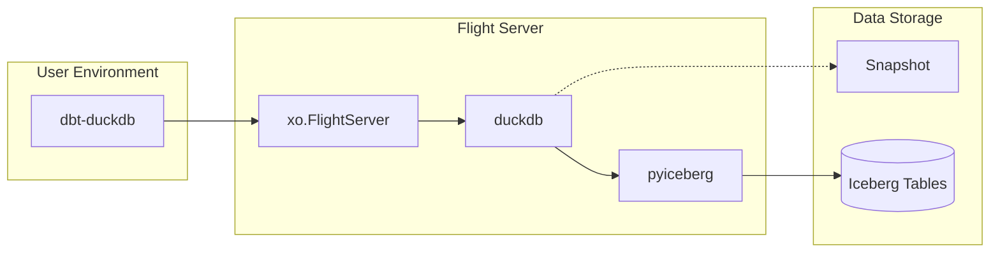

# Multi-Engine: dbt-duckdb with Flight and Iceberg

`dbt-duckdb` → `xo.FlightServer` → `pyiceberg` (with read path using `duckdb` with Iceberg extension)

This plugin integrates dbt-duckdb with xorq to define Flight services for Iceberg and DuckDB. It enables dbt models to read from and write to Iceberg tables through a Flight server.



## Getting Started
### Installing Dependencies
```
uv sync
```

### Running the Flight Server
You can run the Flight server using the provided script:

```bash
uv run iceberg_over_flight.py serve -w warehouse -p 8816
```

### Ingest data

```bash
curl https://d37ci6vzurychx.cloudfront.net/trip-data/yellow_tripdata_2023-01.parquet -o /tmp/yellow_tripdata_2023-01.parquet
uv run ingestion/ingestion.py
```

### Run dbt
```bash
cd dbt_xorq_project
export PYTHONPATH="$PWD:$PYTHONPATH"
dbt run
```

### Supported Operations
- [x] Reading and writing Iceberg tables with Flight Server
- [x] `dbt run` using Flight plugin
- [ ] Filtering and column selection
