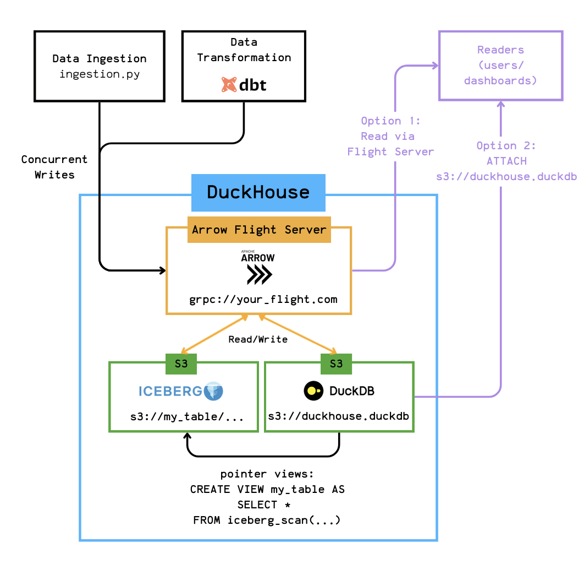

# Duckhouse: DuckDB + Iceberg + Flight

DuckDB has become well-known as a lightweight, portable, and fast OLAP database.

While it excels as an embedded engine, could we push its boundaries further?

Could we build an actual data platform centered around DuckDB?

This is the idea behind Duckhouse:



Check the full article [here](https://juhache.substack.com/p/3465177b-6c6c-417d-912a-be30ef10dab9?postPreview=paid&updated=2025-05-09T06%3A59%3A14.493Z&audience=everyone&free_preview=false&freemail=true)

## Getting Started
### Installing Dependencies
```
uv sync
```

### Running the Flight Server

```bash
uv run iceberg_over_flight.py serve -w warehouse -p 8816
```

### Ingest data

```bash
curl https://d37ci6vzurychx.cloudfront.net/trip-data/yellow_tripdata_2023-01.parquet -o /tmp/yellow_tripdata_2023-01.parquet
uv run ingestion/ingestion.py
```

### Run dbt
```bash
cd dbt_xorq_project
export PYTHONPATH="$PWD:$PYTHONPATH"
dbt run
```

### Supported Operations
- [x] Reading and writing Iceberg tables with Flight Server
- [x] `dbt run` using Flight plugin
- [ ] Filtering and column selection
