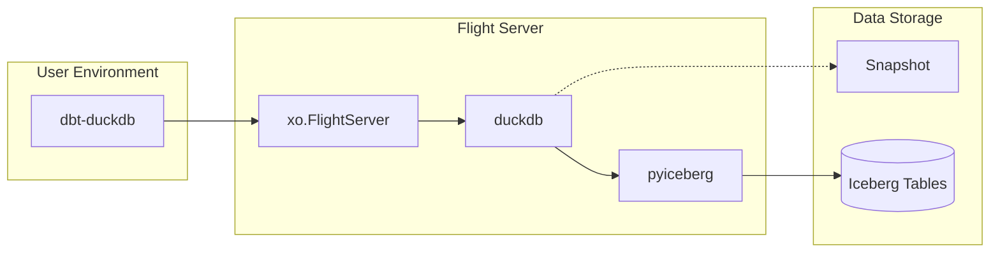

# Multi-Engine: dbt-duckdb with Flight and Iceberg

`dbt-duckdb` → `xo.FlightServer` → `pyiceberg` (with read path using `duckdb` with Iceberg extension)

This plugin integrates dbt-duckdb with xorq to define Flight services for Iceberg and DuckDB. It enables dbt models to read from and write to Iceberg tables through a Flight server.



## Getting Started
### Installing Dependencies

This project uses uv for dependency management. To install dependencies:

Override the wheel location in pyproject.toml:
If you need to use a locally built wheel for xorq,
you can modify the tool.uv.sources section in your pyproject.toml:

```
toml[tool.uv.sources]
multi-engine-data-stack-arrow-flight = { workspace = true }
xorq = { path = "/path/to/your/xorq-0.2.0-cp38-abi3-linux_x86_64.whl" }
```

### Run
```bash
cd dbt_xorq_project
export PYTHONPATH="$PWD:$PYTHONPATH"
dbt run
```

### Prerequisites
Before using this plugin, you need:
1. A running xorq Flight server with configured Iceberg catalog
2. The xorq Python package installed (`pip install xorq`)
3. PyArrow installed (`pip install pyarrow`)

## Configuration

### Profile Configuration
In your `profiles.yml` file, configure dbt to use the Flight plugin:
```yaml
dbt_xorq:
  target: dev
  outputs:
    dev:
      type: duckdb
      path: ":memory:"
      plugins:
        - module: plugins.flight 
          config:
            host: localhost
            port: 8816
      threads: 1
```

### Running the Flight Server
You can run the Flight server using the provided script:

```bash
python iceberg_over_flight.py serve -w warehouse -p 8816
```

## Current Status

### Supported Operations
- [x] Reading and writing Iceberg tables with Flight Server
- [x] `dbt run` using Flight plugin
- [ ] Filtering and column selection
